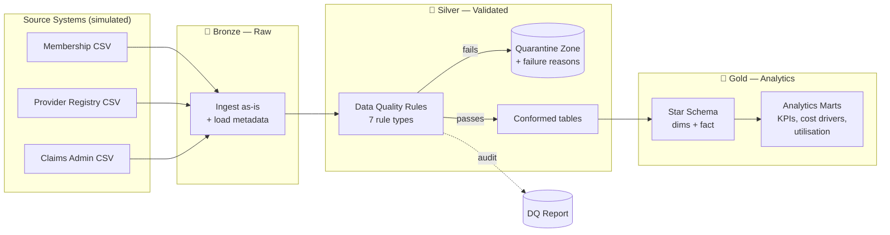

# Healthcare Claims Data Platform


An end-to-end **ELT data platform** for health insurance claims, built on the
**medallion architecture** (Bronze → Silver → Gold). It ingests raw extracts from
three simulated source systems, enforces a **config-driven data quality framework**
with row-level quarantine and audit reporting, and builds a **dimensional star
schema** with BI-ready analytics marts — all fully tested and CI-verified.

> **Why claims data?** I spent part of my career working with healthcare claims
> data at Medi Assist, where late submissions, duplicate claims, and referential
> breaks between membership and claims systems were daily realities. This project
> recreates those problems deliberately — and solves them with engineering.

---

## Architecture



**Warehouse:** DuckDB · **Transformation:** Python (pandas) + versioned SQL ·
**Orchestration:** Python pipeline runner with structured logging ·
**Testing:** pytest (unit + end-to-end integration) · **CI:** GitHub Actions · **Packaging:** Docker

---

## Key Features

| Capability | Implementation |
|---|---|
| **Config-driven data quality** | 7 declarative rule types (`not_null`, `unique`, `allowed_values`, `min_value`, `regex_match`, `date_order`, `referential`) defined in YAML — new rules require zero code changes |
| **Quarantine, don't drop** | Failing rows are written to a quarantine zone with machine-readable failure reasons, preserving auditability |
| **DQ audit reporting** | Every run persists a pass-rate report per rule to CSV and an `audit.dq_report` warehouse table |
| **Dimensional modelling** | Kimball-style star schema: `fact_claims` at claim grain, conformed `dim_member`, `dim_provider`, `dim_date` |
| **BI-ready marts** | Monthly KPIs (approval rate, payout ratio, submission lag), specialty cost drivers, member utilisation vs premium |
| **Tested end-to-end** | 13 tests: unit tests on every DQ rule + integration tests validating referential integrity and KPI sanity in the built warehouse |
| **Reproducible** | Seeded synthetic data generator, Makefile targets, Dockerfile, CI pipeline that runs the whole platform on every push |

---

## Quickstart

```bash
git clone https://github.com/ShabnamSultanaS/healthcare-claims-data-platform.git
cd healthcare-claims-data-platform

pip install -r requirements.txt

make data       # generate ~50k synthetic claims with realistic DQ issues
make pipeline   # run Bronze -> Silver -> Gold
make test       # run the full test suite
```

Or with Docker:

```bash
docker build -t claims-platform .
docker run claims-platform
```

Explore the warehouse interactively:

```bash
duckdb warehouse/claims.duckdb
D SELECT * FROM gold.mart_monthly_kpis ORDER BY month DESC LIMIT 6;
```

## Sample Output

```
  month  total_claims  total_billed_eur  total_approved_eur  approval_rate_pct  avg_submission_lag_days  payout_ratio_pct
2026-06          1576        6710322.17          3522560.11              69.23                     22.9             52.49
2026-05          1668        7211478.75          3736384.61              68.53                     22.5             51.81
2026-04          1577        6664578.93          3465590.52              68.36                     22.6             52.00
```

A typical run ingests **50,500 claims**, quarantines **~3,600 rows** across
**11 quality rules**, and builds the full star schema in **under one second**.

---

## The Data Quality Problem (by design)

The source generator deliberately injects issues found in real claims systems:

- **Duplicate claim submissions** (resubmission without reversal)
- **Negative billed amounts** (reversal artefacts landing in the wrong feed)
- **Orphan member references** (claims arriving before membership sync)
- **Impossible date sequences** (service date after submission date)
- **Invalid status codes** and **inconsistent categorical casing**
- **Missing mandatory fields** (county, specialty)

Each issue is caught by a declared rule in [`config/pipeline.yaml`](config/pipeline.yaml),
quarantined with a reason code, and surfaced in the DQ report — nothing is
silently dropped.

## Project Structure

```
├── config/pipeline.yaml       # Paths + declarative DQ rules (single source of truth)
├── src/
│   ├── generate_source_data.py  # Seeded synthetic data with injected DQ issues
│   ├── quality.py               # Reusable rule engine + quarantine + reporting
│   └── run_pipeline.py          # Bronze/Silver/Gold orchestrator
├── sql/
│   ├── gold/                    # Versioned DDL: dimensions, fact, marts
│   └── analytics/               # Example analyst queries (window functions, cohorts)
├── tests/                       # Unit + end-to-end integration tests
├── .github/workflows/ci.yml     # Lint-free CI: tests + full pipeline smoke run
├── Dockerfile · Makefile · requirements.txt
```

## Example Analytics

See [`sql/analytics/example_queries.sql`](sql/analytics/example_queries.sql) for
queries answering real business questions:

1. Month-over-month approved-spend growth (window functions)
2. Top cost-driving procedures
3. Members claiming over 3× their annual premium (loss-ratio risk)
4. Out-of-network cost premium by specialty
5. 30-day submission SLA breach rate

## Design Decisions

- **DuckDB over Postgres/SQLite** — columnar, analytics-native, zero-infrastructure;
  the SQL is ANSI-standard and portable to Snowflake/BigQuery/Fabric with minimal change.
- **Quarantine over rejection** — regulated domains (health, finance) require an
  audit trail; bad rows are evidence, not garbage.
- **YAML-declared rules over hardcoded checks** — data quality becomes reviewable
  configuration, and the rule engine is reusable across any dataset.
- **SQL for the Gold layer** — dimensional transforms live in versioned `.sql`
  files (dbt-style), keeping business logic readable by analysts.

## Roadmap

- [ ] dbt migration of the Gold layer with built-in tests and docs
- [ ] Incremental (delta) loading with watermark tracking
- [ ] Airflow/Dagster DAG for scheduled orchestration
- [ ] Power BI dashboard over the marts

## Author

**Shabnam Sultana** — Data Management Analyst, Dublin
MSc Data Analytics (Dublin Business School) · Microsoft Certified: Azure Data Fundamentals (DP-900)
[LinkedIn](https://www.linkedin.com/in/shabnamsultanas/) · Experience across SQL/T-SQL, Power BI, Python, SSIS/SSRS, ETL/ELT, and data governance
